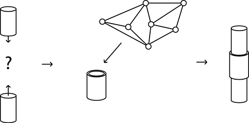

## How it works

### Parametrics and interfaces

Where traditional construction sets rely heavily on standardization and meticulous top-down design, *Peer Parts* proposes a radically different approach. It relies primarily on an open source CAD system that allows anyone to contribute, share and manufacture parts and assemblies.

The system defines parts as parametric geometry. Rather than using a regular grid-like system to facilitate fit between parts, a parametric search engine finds emergent fit. Instead of having to search for a certain piece by hand, the software computationally finds fitting parts in the network.

The parametric model increases the chance of inter-operability, because parts are loosly-fitted and scale-indepent.
This allows the system to be applicable within many domains, including household design, hardware hacking or even architecture.

### Peer-to-peer manufacture

Components contain information about the possible materials and manufacturing methods that are available for it.
Production facilities and shops (fab-labs, people with 3d printers, parts-stores, etc) can set up a sourcing node. ~~Bidding in a virtual marketplace to deliver the part at a certain price, dependent on your location.~~ Price information can be used to generate price estimations for a project. Alternatively there could simply be a centralized *Peer Parts* webshop.

### Implementation
*Peer Parts* could be implemented in a number of ways, including a website and editing app. Another option could be an actual peer-to-peer network in a stand alone application.

## Ad-hocism
Central to the *Peer Parts* system is the idea that 'design' objects may look great in pictures, reality is often a tingle-tangle mess of lo and hi-fi solutions (i.e. broken smartphones fixed with duct-tape). Rather than trying to design perfect objects, everyday improvised solutions to problems should be embraced. Empowering people over 'designers' to create their own environment by iterative and playful search (trying, retrying, adapting, breaking down).
Instead of creating singular throw-away units, *Peer Parts* focuses on modular design. Broken parts can be replaced, obsolescent units can be taken apart and reused or sold.