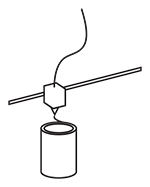

# Peer Parts
An **open source, socio-technical** system for **do-it-yourself** design using **digital manufacturing**.

## Philosopy
The *Peer Parts* project explores the possibility of a [emergent](http://en.wikipedia.org/wiki/Emergence), distributed [construction set](http://en.wikipedia.org/wiki/Construction_set). Where traditional construction sets rely heavily on standardization and meticulous top-down design, *Peer Parts* proposes a radically different approach. It relies primarily on an open source CAD system that allows anyone to contribute, share and manufacture parts and assemblies. The network facilitates a certain resonance between disparate design efforts that enables ultimate inter-operability. There are several ways that this wil work:

### Parametrics and interfaces

The system defines parts as parametric geometry. Rather than using a regular grid-like system to facilitate fit between parts, a parametric search engine finds emergent fit. That is, rather than having to search for a certain piece by hand, The software computationally finds fitting parts in the network.
The parametric model increases the chance of inter-operability, because parts are loosly-fitted and scale-indepent.
This allows the system to be as useful as a toy, for household design, hardware hacking or even architecture.

see also: [universal construction kit](http://fffff.at/free-universal-construction-kit/)

### Peer-to-peer manufacture

Components contain information about the possible materials and manufacturing methods that are available for it.
Production facilities and shops(fab-labs, people with 3d printers, parts-stores, etc) can set up a sourcing node. Bidding in an automatic auction to deliver the part at a certain price, dependent on your location. Price information can be used to generate price estimations for a project.

This information can be linked to databases containing information about local production and sourcing facilities (fab-labs, parts-shops, etc). This allows a user to source all the components as cheaply as possible. Alternatively there could simply be a centralized *Peer Parts* webshop.

### Ad-hocism

## Implementation
