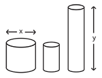
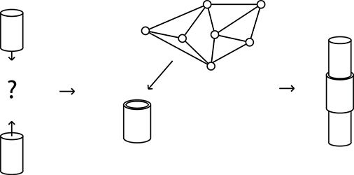
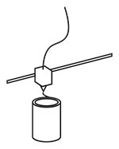

## How it works
Peer parts can be seen as an attempt to make a construction set for DIY design. It is meant to be used by non-experts to (re)construct and form their own living environment.

Unlike a construction set however, Peer-Parts is not a self-enclosed system of 'official' parts, nor does it enforce any standardization. Instead it attempts to latch on, subvert, incorporate or parasitize any existing components or structures in order to combine them in an ad-hoc way.

### Procedural CAD
*Peer Parts* relies primarily on an open source CAD system that allows anyone to contribute, share and manufacture parts and assemblies.

Rather than using a regular grid-like pattern to design parts, the system defines parts as **procedural** elements. This means objects are stored not only as their geometry and dimensions, but also their structure and semantics. This makes it easy to find homology or isomorphism between parts. In order to find parts that fit together, instead of having to search for a certain piece visually by hand, the software computationally finds fitting parts in the network.

The procedural model increases the chance of inter-operability, because parts can be loosly-fitted and are largely independent of scale.
This allows the system to be applicable within many domains, including household design, hardware hacking or even architecture.

### Tactile Building
Once the user has found parts using the CAD system, they will have to put them together by hand. The system should allow users to design both by tactile experimentation and by computer. There will need to be research on augmentation between digital and physical realms.

### Peer-to-peer manufacture

Components contain information about the possible materials and manufacturing methods that are available for it.
Production facilities and shops (fab-labs, people with 3d printers, parts-stores, etc) can set up a sourcing node. Each node can bid in a virtual marketplace to deliver the part at a certain price, dependent on your location. Price information can be used to generate price estimations for a project. Alternatively there could simply be a centralized *Peer Parts* webshop.

### Implementation
*Peer Parts* could be implemented in a number of ways, including a peer-to-peer network in a stand alone application. Another option could be a website and editing app.

## Ad-hocism
Central to the *Peer Parts* system is the idea that 'design' objects may look great in pictures, reality is often a tingle-tangle mess of lo and hi-fi solutions (i.e. broken smartphones fixed with duct-tape). Rather than trying to design perfect objects, everyday improvised solutions to problems should be embraced. Empowering people over 'designers' to create their own environment by iterative and playful search (trying, retrying, adapting, breaking down).
Instead of creating singular throw-away units, *Peer Parts* focuses on modular design. Broken parts can be replaced, obsolescent units can be taken apart and reused or sold.
